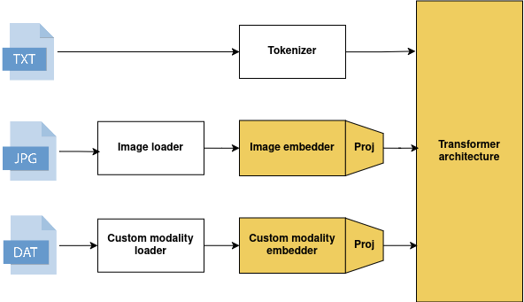

<div align="center">
    
    <a href="https://epflight.github.io/MultiMeditron/index.html">
        
    </a>
    
</div>


**MultiMeditron** is a **modular multimodal large language model (LLM)** built by students and researchers from [**LiGHT Lab**](https://www.light-laboratory.org/).
It is designed to seamlessly integrate multiple modalities such as text, images, or other data types into a single unified model architecture.


## 🚀 Key Features

* **🔗 Modular Design:**
  Easily plug in new modalities by following our well-documented interface. Each modality embedder (e.g., CLIP, Whisper, etc.) can be independently developed and added to the model.

* **🧩 Modality Interleaving:**
  Supports interleaved multimodal inputs (e.g., text-image-text sequences), enabling complex reasoning across different data types.

* **⚡ Scalable Architecture:**
  Designed for distributed and multi-node environments — ideal for large-scale training or inference.

* **🧠 Flexible Model Backbone:**
  Combine any modality embedder (like CLIP or SigLIP) with any LLM (like Llama, Qwen, or custom fine-tuned models).


## 🏗️ Model Architecture

<div align="center">
    
</div>

## ⚙️ Setup


### Using Docker (recommended)

On AMD64 architecture:

```bash
docker pull michelducartier24/multimeditron-git:latest-amd64
```

On ARM64 architecture:

```bash
docker pull michelducartier24/multimeditron-git:latest-arm64
```

### Using uv

**Prerequisite:** To install the right version of torch with your CUDA driver, please refer to [this documentation](https://pytorch.org/get-started/locally/)

 Install [uv](https://docs.astral.sh/uv/):

```bash
curl -LsSf https://astral.sh/uv/install.sh | sh
```

Clone the repository: 

```bash
git clone https://github.com/EPFLiGHT/MultiMeditron.git
cd MultiMeditron
```

Install dependencies:

```bash
uv pip install -e ".[flash-attn]"
```


## 💬 Inference Example

Here’s an example showing how to use **MultiMeditron** with **Llama 3.1 (8B)** and a single image input.

```python
import torch
from transformers import AutoTokenizer
import os
from multimeditron.dataset.preprocessor import modality_preprocessor
from multimeditron.dataset.loader import FileSystemImageLoader
from multimeditron.model.model import MultiModalModelForCausalLM
from multimeditron.dataset.preprocessor.modality_preprocessor import ModalityRetriever, SamplePreprocessor
from multimeditron.model.data_loader import DataCollatorForMultimodal

ATTACHMENT_TOKEN = "<|reserved_special_token_0|>"

# Load tokenizer
tokenizer = AutoTokenizer.from_pretrained("meta-llama/Meta-Llama-3.1-8B-Instruct", dtype=torch.bfloat16)
tokenizer.pad_token = tokenizer.eos_token
tokenizer.add_special_tokens({'additional_special_tokens': [ATTACHMENT_TOKEN]})
attachment_token_idx = tokenizer.convert_tokens_to_ids(ATTACHMENT_TOKEN)

# Load model
model = MultiModalModelForCausalLM.from_pretrained("path/to/trained/model")
model.to("cuda")

# Define input
modalities = [{"type": "image", "value": "path/to/image"}]
conversations = [{
    "role": "user",
    "content": f"{ATTACHMENT_TOKEN} Describe the image."
}]
sample = {"conversations": conversations, "modalities": modalities}

loader = FileSystemImageLoader(base_path=os.getcwd())

collator = DataCollatorForMultimodal(
    tokenizer=tokenizer,
    tokenizer_type="llama",
    modality_processors=model.processors(),
    modality_loaders={"image": loader},
    attachment_token_idx=attachment_token_idx,
    add_generation_prompt=True,
)

batch = collator([sample])

with torch.no_grad():
    outputs = model.generate(batch=batch, temperature=0.1)

print(tokenizer.batch_decode(outputs, skip_special_tokens=True, clean_up_tokenization_spaces=True)[0])
```


## 🧩 Adding a New Modality

MultiMeditron’s architecture is fully **extensible**.
To add a new modality, see the [developer documentation](https://epflight.github.io/MultiMeditron/guides/add_modality.html) for a step-by-step guide.


## ⚖️ License

This project is licensed under the Apache 2.0 License, see the [LICENSE 🎓](LICENSE) file for details.


## 📖 Cite us

TODO
